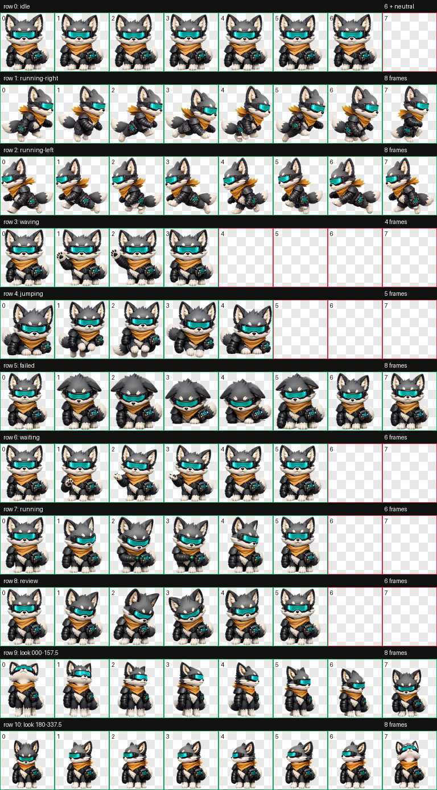
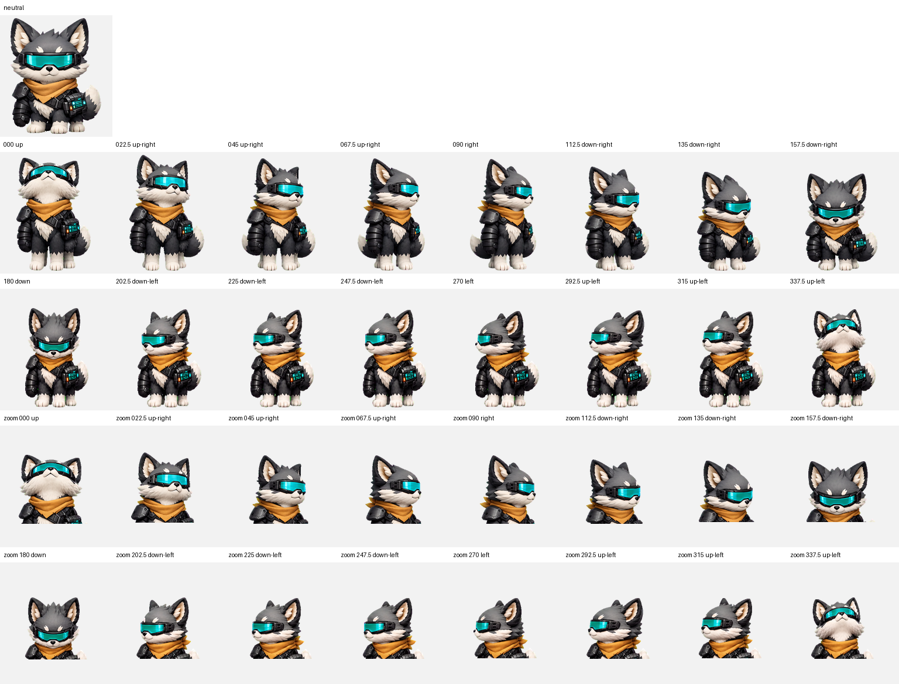

# Mandalorian — Codex Pet

Mandalorian is an original armored fox-cat companion for Codex: calm, loyal, tactical, and mildly deadpan. It treats bugs, flaky tests, and messy diffs like trails to track—while keeping the final change surgical.

This repository contains a complete Codex v2 pet package with nine standard animation states and sixteen clockwise look directions.



## Highlights

- Original non-human armored code guardian
- Premium 3D game-companion style
- Nine standard Codex animation rows
- Sixteen look directions with verified cardinal semantics
- Transparent `1536×2288` WebP atlas
- Codex pet manifest with `spriteVersionNumber: 2`
- Guarded one-command installer

## Install

Clone the repository and run the installer:

```bash
git clone https://github.com/baoxiaopan/codex-pet-mandalorian.git
cd codex-pet-mandalorian
./scripts/install.sh
```

SSH is also available as an optional alternative: `git@github.com:baoxiaopan/codex-pet-mandalorian.git`.

The installer copies the package to:

```text
${CODEX_HOME:-$HOME/.codex}/pets/mandalorian/
├── pet.json
└── spritesheet.webp
```

`jq` is required for manifest validation.

## Manual Installation

```bash
PET_DIR="${CODEX_HOME:-$HOME/.codex}/pets/mandalorian"
mkdir -p "$PET_DIR"
cp pet.json spritesheet.webp "$PET_DIR/"
```

Both files must be installed together. The `spriteVersionNumber: 2` field is required for the 11-row atlas contract.

## Update

```bash
git pull --ff-only
./scripts/install.sh
```

## Verify

Verify the published package bytes before installation:

```bash
shasum -a 256 -c SHA256SUMS
```

Confirm the manifest:

```bash
jq '{id, displayName, spriteVersionNumber, spritesheetPath}' pet.json
```

Expected values:

```json
{
  "id": "mandalorian",
  "displayName": "Mandalorian",
  "spriteVersionNumber": 2,
  "spritesheetPath": "spritesheet.webp"
}
```

The curated QA records are available under [`qa/`](qa/):

- [`validation.json`](qa/validation.json): atlas dimensions, grid, alpha, and v2 validation
- [`chroma-despill.json`](qa/chroma-despill.json): edge-local chroma cleanup result
- [`direction-semantics.json`](qa/direction-semantics.json): all sixteen labeled direction verdicts
- [`final-visual-qa.json`](qa/final-visual-qa.json): final identity, animation, and continuity review



## Uninstall

Remove only this pet directory:

```bash
rm -r "${CODEX_HOME:-$HOME/.codex}/pets/mandalorian"
```

## Repository Layout

```text
.
├── README.md
├── LICENSE.md
├── LICENSE-MIT
├── LICENSE-CC-BY-4.0
├── SHA256SUMS
├── pet.json
├── spritesheet.webp
├── assets/
│   ├── contact-sheet.png
│   └── look-directions.png
├── qa/
│   ├── validation.json
│   ├── chroma-despill.json
│   ├── direction-semantics.json
│   └── final-visual-qa.json
├── scripts/
│   └── install.sh
└── docs/superpowers/
    ├── plans/
    └── specs/
```

## Character and IP Boundary

Mandalorian is an original fox-cat mascot inspired only by broad armored-guardian and space-western themes. It does not depict or copy a known franchise protagonist, protected helmet or armor design, insignia, named lore, companion character, weapon, or catchphrase.

The name identifies this custom Codex pet. No affiliation with or endorsement by any entertainment franchise is claimed.

## License

This repository uses a dual-license policy. Scripts, documentation, metadata, QA JSON, and checksum files are available under the [MIT License](LICENSE-MIT). `spritesheet.webp` and image files under `assets/` are available under the [Creative Commons Attribution 4.0 International license](LICENSE-CC-BY-4.0). See the concise [license map](LICENSE.md) for file-level scope.

Artwork reuse requires appropriate credit to Baoxiaopan, a link to the [CC BY 4.0 license](https://creativecommons.org/licenses/by/4.0/), and an indication of whether changes were made.
